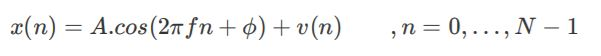
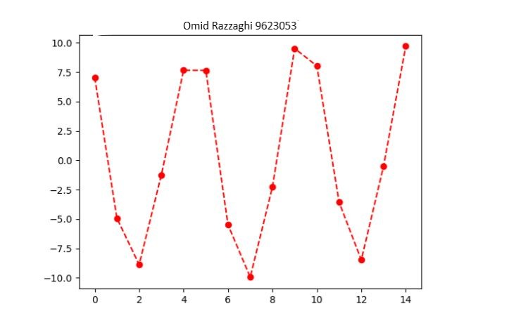

# Transmitter 
In the Transmitter class, you get the amplitude (A), the frequency (f) and the (ϕ) phase of the
transmitted sinusoidal signal. Of course as the signal is transmitted, it would be noise
corrupted. So we assume that a WGN (White Gaussian Noise) with a known standard
deviation (σ) is added to the sinusoidal. So the transmitted signal is:



This class has the following functions:
- ```_init_(self, A=10, f=0.2, phi=np.pi/4, sigma=1)```
- ```generate(N)```
This function gets the length of the signal, N, and generates the signal we would
get on the receiver. It returns the generated signal as a numpy ndarray with shape
(N,)

- ```show()```
This function plots the generated signal in 3 cycles like the following figure. Don't
forget to put your name as the title of the figure and save it with the
Generated.png name.



Your class should be able to handle the following codes:

```
xmt = Transmitter()
x = xmt.generate(100)
xmt.show()
```